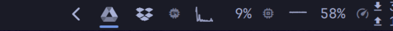
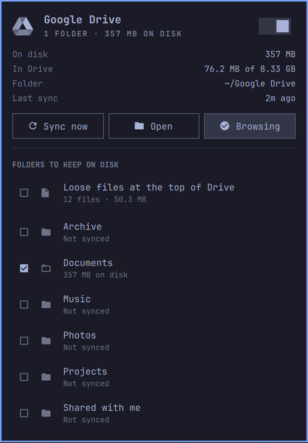

<h1 align="center">Google Drive</h1>

<p align="center">
  Selective two-way Google Drive sync for the <a href="https://omarchy.org">Omarchy</a> bar —
  the folders you pick live on disk, the rest never leave the cloud.
<br>
  <sub>by <a href="https://x.com/hominluo">@hominluo</a></sub>
</p>

<p align="center">
  
</p>

<p align="center">
  
</p>

<p align="center">
  <a href="#install">Install</a> ·
  <a href="#connect-google-drive">Connect Drive</a> ·
  <a href="#the-panel">The panel</a> ·
  <a href="#settings">Settings</a> ·
  <a href="#how-it-syncs">How it syncs</a> ·
  <a href="#after-a-reboot">After a reboot</a>
</p>

---

Google ships no Drive client for Linux. The usual workaround is an rclone FUSE
mount, but a mount means your files aren't really on disk: they vanish when
you're offline and every app pays a network round trip. A full sync fixes that
and drags your entire account down with it.

This does neither by default. Tick the folders worth having locally and they
become ordinary files that any program can open offline. Everything you didn't
tick is never listed, let alone downloaded — still one click away in a
read-only browse mount when you need it.

|  | rclone mount | Full sync | This |
|---|---|---|---|
| Files really on disk | no | yes | the ones you pick |
| Works offline | only what's cached | yes | yes |
| Downloads everything | no | yes | no |
| Keeps running if the bar restarts | no | — | yes, systemd timer |

## Install

```bash
omarchy pkg add rclone fuse3
omarchy plugin add https://github.com/hominluo/omarchy-google-drive.git --enable
omarchy bar move io.github.hominluo.google-drive --after omarchy.tray
```

The widget appears in the bar immediately and downloads nothing until you pick
a folder. Until a Drive remote exists it simply reports what's missing.

| Needed for | Package |
|---|---|
| Everything — syncing and mounting (rclone 1.66+) | `rclone` |
| The backend | `python` |
| Unmounting the browse view | `fuse3` |
| Detecting mounts and dead endpoints | `util-linux` |
| The **Open** buttons | `nautilus` |
| The bar widget, and a systemd **user** session | Omarchy with the Quickshell bar |

Only `rclone` is strictly required. Without `fuse3` the browse mount is
unavailable; without `nautilus` the Open buttons do nothing. Syncing needs
neither.

To remove it, see [Uninstall](#uninstall).

## Connect Google Drive

The plugin drives rclone but never configures it, so do this once. It never
reads or writes your client ID, secret, or OAuth token — rclone owns all of it.

### 1. Make your own Google OAuth client

rclone's shared Drive client is being retired during 2026 and is heavily
rate-limited meanwhile. Your own is free and takes a few minutes.

1. In the [Google Cloud console](https://console.cloud.google.com/), create a
   project or pick one.
2. **APIs & Services → Library →** enable the **Google Drive API**.
3. **APIs & Services → OAuth consent screen →** choose **External**, fill in an
   app name and your email, then **publish the app to Production**.
   Left in *Testing*, Google expires your refresh token after **7 days** and
   syncing stops silently. Personal use needs no verification review.
4. **APIs & Services → Credentials → Create credentials → OAuth client ID →**
   application type **Desktop app**. Copy the client ID and client secret.

rclone's [client ID guide](https://rclone.org/drive/#making-your-own-client-id)
has the same steps with screenshots.

### 2. Create the remote

```bash
rclone config create gdrive drive \
  client_id=YOUR_CLIENT_ID.apps.googleusercontent.com \
  client_secret=YOUR_CLIENT_SECRET \
  scope=drive
```

Answer `y` to the browser question. Google warns that the app is unverified —
expected for a personal client: **Advanced → Go to … (unsafe)**.

`scope=drive` is read/write over your whole Drive, which two-way sync needs. Use
`drive.readonly` to only ever pull down.

Prefer being asked? Plain `rclone config` walks the same questions.

### 3. Check it

```bash
rclone listremotes      # lists gdrive:
rclone about gdrive:    # prints your storage usage
```

Numbers from `rclone about` mean you're done. Open the panel and tick a folder.

> Already have a `gdrive:` on rclone's shared client? Run `rclone config`,
> **Edit existing remote → gdrive**, enter your own ID and secret, keep the
> scope, and replace the token when prompted.

## The panel

Left click opens it, right click refreshes.

| Key | Action |
|---|---|
| `j` / `k`, arrows | Move through folders |
| Enter / Space | Toggle the folder under the cursor, or the auto-sync switch |
| `s` | Sync now |
| `a` | Toggle automatic sync |
| `b` | Mount / unmount the browse view |
| `o` | Open the synced folder |
| `r` | Refresh |
| `c` | Clean up folders you stopped syncing |
| Escape | Close |

**Browse all** mounts your whole Drive read-only at `~/GDrive-Browse` without
downloading it — for reaching something you never synced. Right-click it to open
the folder instead of toggling it.

Unticking a folder only *stops syncing* it. The files stay, and the panel says
how much room they take. **Clean up** deletes them, but only after
`rclone check --one-way` proves every local file still exists in Drive; a folder
that fails the check is left alone and reported. Nothing is deleted on an
unverified path.

Google-native files — Docs, Sheets, Slides — are skipped. They have no real file
to store; open them in a browser.

## Settings

```bash
omarchy bar set io.github.hominluo.google-drive remoteName gdrive
omarchy bar set io.github.hominluo.google-drive folderPath "$HOME/Google Drive"
omarchy bar set io.github.hominluo.google-drive browseMountPath "$HOME/GDrive-Browse"
omarchy bar set io.github.hominluo.google-drive syncIntervalMin 10 --json
```

| Setting | Default | What it is |
|---|---:|---|
| `remoteName` | `gdrive` | rclone remote name, no trailing colon |
| `folderPath` | `~/Google Drive` | The real on-disk synced folder |
| `browseMountPath` | `~/GDrive-Browse` | Read-only on-demand view of the whole Drive |
| `syncIntervalMin` | `10` | Written to a systemd timer drop-in |
| `refreshIntervalSec` | `30` | How often the panel re-reads status |

Numeric values need `--json`; strings don't.

## How it syncs

[`rclone bisync`](https://rclone.org/bisync/) does the work.

- **Your selection becomes a filter.** Ticked folders compile to an rclone
  `--filters-file`; everything else is excluded, so bisync never even lists it.
- **A systemd user timer runs it**, not the bar — syncing survives a shell
  restart. `Type=oneshot` plus bisync's own lock stops runs overlapping.
- **Baselines happen automatically.** bisync needs `--resync` before its first
  run and again whenever the filters change. The backend hashes the filters file
  after each good run and re-baselines itself when it differs, so ticking a new
  folder just works instead of aborting.
- **Conflicts** resolve to the newer file.

## After a reboot

Everything that should come back does, and none of it needs the bar running.

- **Sync** — the timer is `WantedBy=timers.target`, rearmed at login, firing 2
  minutes after boot and every 10 minutes after.
- **Browse mount** — its own unit is `WantedBy=default.target`, and the panel's
  Browse toggle enables or disables that unit rather than only mounting. The
  state you left it in is the state you get back.
- **A mount whose daemon died** — power loss leaves a FUSE mount in the mount
  table answering every call with `ENOTCONN`. Liveness is probed rather than
  trusting the table, and the dead mount is detached before remounting.
- **A bisync lock orphaned by a hard reboot** would block every later run. It's
  cleared automatically, but only once no `rclone bisync` process is alive.
- **Booting before the network** — a sync that fails only for that is recorded
  as `offline`, not an error. The bar says "Waiting for network" and the next
  tick picks it up.

Both units are per-user, so they start when you log in. To keep syncing while
logged out: `sudo loginctl enable-linger "$USER"`.

## Notes

- Plugins run unsandboxed inside `omarchy-shell`. This one installs no packages,
  asks for no elevated privileges, and never touches rclone's configuration.
  Every command is executed as an argument array, never an interpolated shell
  string.
- It writes two systemd user units, and only when you first enable sync or the
  browse mount. Both are listed under [Uninstall](#uninstall).
- The interpreter baked into those units is `/usr/bin/python3` on purpose: a
  systemd user unit doesn't inherit the PATH that mise, pyenv or asdf put their
  shims on, and those paths move on every version bump.
- The marketplace security baseline reports four capabilities for this plugin,
  and it is worth being precise about which are the plugin's. Three of them —
  package management, privilege, and remote build — are detected from commands
  in *this README* that **you** run once: installing `rclone`, optionally
  enabling systemd lingering, and cloning the repo to work on it. The plugin
  itself does none of those. The fourth, service management, is genuinely its
  own: it writes and enables the two systemd user units above, which is how
  syncing survives a reboot.

### Diagnostics

```bash
omarchy-shell io.github.hominluo.google-drive status
python3 ~/.config/omarchy/plugins/io.github.hominluo.google-drive/gdrive-sync.py status | jq

systemctl --user list-timers omarchy-gdrive-sync.timer
systemctl --user status omarchy-gdrive-sync.service omarchy-gdrive-browse.service
journalctl --user -u omarchy-gdrive-sync.service -n 50

tail -40 ~/.local/state/omarchy-gdrive/sync.log   # rclone's own log
cat ~/.local/state/omarchy-gdrive/filters.txt     # your selection, compiled
jq . ~/.local/state/omarchy-gdrive/state.json     # last run result
```

Prove the boot path without rebooting:

```bash
systemctl --user stop omarchy-gdrive-browse.service omarchy-gdrive-sync.timer
systemctl --user start default.target timers.target
```

Force a fresh baseline — safe, bisync builds a superset rather than deleting:

```bash
python3 ~/.config/omarchy/plugins/io.github.hominluo.google-drive/gdrive-sync.py run --resync
```

### Uninstall

```bash
systemctl --user disable --now omarchy-gdrive-sync.timer omarchy-gdrive-browse.service
rm -f ~/.config/systemd/user/omarchy-gdrive-sync.{service,timer}
rm -f ~/.config/systemd/user/omarchy-gdrive-browse.service
rm -rf ~/.config/systemd/user/omarchy-gdrive-sync.timer.d
systemctl --user daemon-reload
omarchy plugin remove io.github.hominluo.google-drive
```

Your synced folder, the rclone remote, and everything in Drive are left alone.
Delete `~/.local/state/omarchy-gdrive/` to drop the plugin's own state too.

## Development

```bash
git clone https://github.com/hominluo/omarchy-google-drive.git \
  ~/.config/omarchy/plugins/io.github.hominluo.google-drive
omarchy-shell shell rescanPlugins
omarchy plugin enable io.github.hominluo.google-drive
```

Saving a file under `~/.config/omarchy/plugins/` hot-reloads the plugin, though
changes to a QML *component* like the icon need `omarchy restart shell`.
`omarchy plugin validate .` checks the manifest.

| File | What it is |
|---|---|
| `manifest.json` | plugin declaration and the settings schema |
| `gdrive-sync.py` | the backend: selection, filters, bisync, mounts, units |
| `BarWidget.qml` | the bar icon and its IPC handlers |
| `Panel.qml` | the panel: stats, controls, folder picker |
| `Service.qml` | process plumbing between the panel and the backend |
| `GoogleDriveIcon.qml` | the Drive mark, drawn to Google's geometry in your theme |
| `Model.js` | parsing and formatting helpers |

## License

MIT — see [LICENSE](LICENSE), and [NOTICE.md](NOTICE.md) for attributions.

This began as a rewrite of [omarchy-google-drive](https://github.com/wesleycole/omarchy-google-drive)
by Wesley Cole, which takes the FUSE-mount approach to the same problem. The
sync engine is new, but a substantial amount of that project's Quickshell widget
scaffolding survives here, so its copyright is retained alongside mine in the
LICENSE. Both projects are MIT.

The Drive mark is drawn from Google's own artwork, which
[Wikimedia Commons](https://commons.wikimedia.org/wiki/File:Google_Drive_icon_(2020).svg)
records as public domain for copyright and trademarked. It identifies the
service this plugin connects to, and is recoloured to your theme rather than
Google's palette. Google Drive is a trademark of Google LLC; this plugin is not
affiliated with, endorsed by, or sponsored by Google.

---

<p align="center">
  Built by <a href="https://x.com/hominluo">@hominluo</a> ·
  <a href="https://github.com/hominluo">GitHub</a> ·
  <a href="https://github.com/hominluo/omarchy-google-drive/issues">Issues</a> ·
  <a href="https://github.com/hominluo/omarchy-google-drive/releases">Releases</a>
</p>
